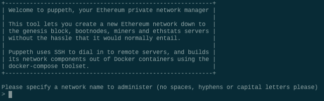
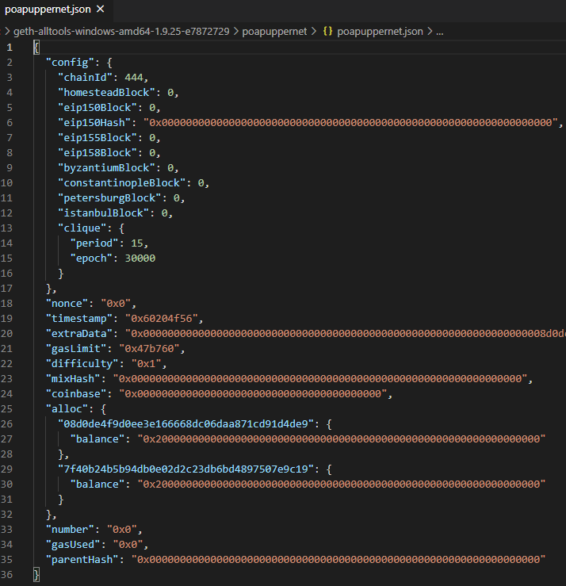
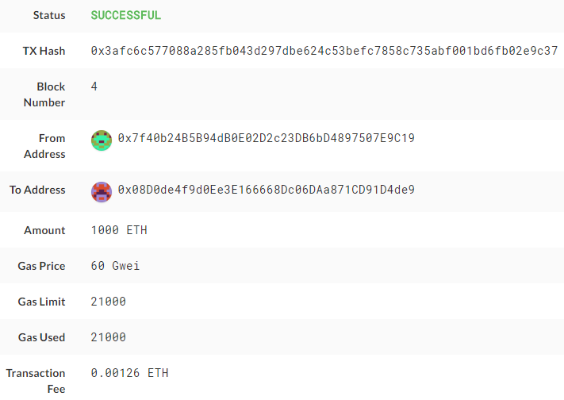

# Proof-of-Authority-Development-Chain


## Environemnt Setup

[Installation Guide link](https://columbia.bootcampcontent.com/columbia-bootcamp/cu-nyc-fin-pt-09-2020-u-c/-/blob/master/18-Blockchain/Supplemental/blockchain-install-guide.md)

## Instructions

* Use below public keys for poaNode1 and poaNode2
```
Public address of poaNode1:   0x7f40b24B5B94dB0E02D2c23DB6bD4897507E9C19

Public address of poaNode2:   0x08D0de4f9d0Ee3E166668Dc06DAa871CD91D4de9

```

* Open a terminal window, navigate to the `Blockchain-Tools` folder and type the following command:

 ```bash
 ./puppeth
 ```

* This should show the following prompt:



* Type in a name for your network, like "puppernet" and hit enter to move forward in the wizard.

* Type `2` to pick the `Configure new genesis` option, then `1` to `Create new genesis from scratch`:


Now you have the option to pick a consensus engine (algorithm) to use.

* Type `2` to choose `Proof of Authority` and continue.

You will be asked to enter a pre-fund account.

* Paste both account addresses from the first step one at a time into the list of accounts to seal.

* Paste them again in the list of accounts to pre-fund. There are no block rewards in PoA, so you'll need to pre-fund.

* You can choose `no` for pre-funding the pre-compiled accounts (0x1 .. 0xff) with wei. This keeps the genesis cleaner.

* Come up with a number to use as a chain ID (e.g. `333`) type it, then hit enter.

You should see a success message and redirected to the original prompt:


* Export genesis configurations. This will fail to create two of the files, but you only need `networkname.json`.

* You can delete the `networkname-harmony.json` file.

* configuration will look like below



* Initialize each node with the new `networkname.json` with `geth`.

* Run the first node, unlock the account, enable mining, and the RPC flag. Only one node needs RPC enabled.

* Set a different peer port for the second node and use the first node's `enode` address as the `bootnode` flag.

* Be sure to unlock the account and enable mining on the second node!

* Use the MyCrypto GUI wallet to connect to the node with the exposed RPC port.

* will need to use a custom network, and include the chain ID, and use ETH as the currency.


* Import the keystore file from the `node1/keystore` directory into MyCrypto. This will import the private key.

* Send a transaction from the `node1` account to the `node2` account.

* Copy the transaction hash and paste it into the "TX Status" section of the app, or click "TX Status" in the popup.

